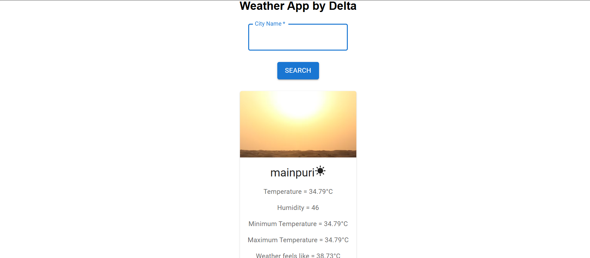

🌦️WEATHER DETECTION WEB APP
---
A sleek and modern weather app built using React, Vite, and the OpenWeatherMap API. Instantly fetch and display real-time weather data for any city with a responsive, user-friendly interface.

---
##demo

---
🚀 Features
---
🌤️ Search by city: Instantly fetch current weather by entering any city name

🌡️ Live data: Temperature, humidity, min/max temperature, and condition description

🌍 Powered by OpenWeatherMap API

⚡ Fast & responsive: Built with React + Vite for lightning-fast development

📱 Mobile-friendly: Fully responsive UI

🚦 Robust UX: Graceful loading and error handling

---

🛠️ Getting Started
✅ Prerequisites
Node.js (v16 or higher)

npm or yarn

---

📦 Installation
---
Clone the repository:

bash
Copy
Edit
git clone https://github.com/subhratagarwal/weather-detection-app.git
cd weather-detection-app
Install dependencies:

bash
Copy
Edit
npm install
# or
yarn install
Get your OpenWeatherMap API key:

Sign up at https://openweathermap.org/

Copy your API key

Set up the API key in the project:

Open WeatherApp.jsx

Replace YOUR_API_KEY with your actual API key

💡 For better security, create a .env file and store the API key as:

env
Copy
Edit
VITE_WEATHER_API_KEY=your_actual_key
Then access it using import.meta.env.VITE_WEATHER_API_KEY

Start the development server:

bash
Copy
Edit
npm run dev
# or
yarn dev
Visit http://localhost:5173 in your browser.

---

📁 Project Structure
bash
Copy
Edit
src/
├── App.jsx              # Root component
├── WeatherApp.jsx       # Main weather logic
├── SearchBox.jsx        # Search input UI
├── InfoBox.jsx          # Weather display component
├── Loader.jsx           # Loading spinner
├── ErrorMessage.jsx     # Error display
├── assets/              # Weather icons, images
│   └── [your images here]
├── App.css              # App styling
├── index.css            # Global styles
...

--
🎨 Customization
---
Weather Icons
Replace icons in the assets/ folder

Update paths or logic in InfoBox.jsx as needed

Styling
Modify CSS files like App.css, InfoBox.css, etc.

Update colors, fonts, layout, and responsiveness to suit your style

🚀 Deployment
Easily deploy this app using:

Vercel

Netlify

GitHub Pages

Just deploy the contents of the dist/ folder after running:

bash
Copy
Edit
npm run build
# or
yarn build
🧾 License
This project is open-source and available under the MIT License.

🙌 Acknowledgements
OpenWeatherMap

React

Vite

